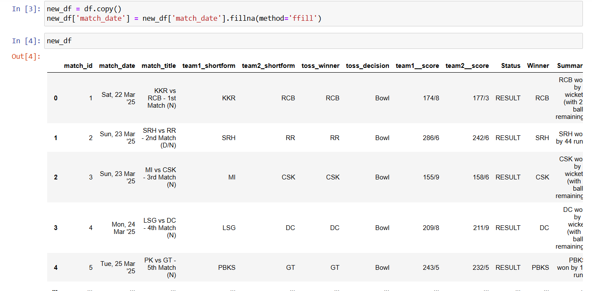

# 🏏 IPL 2025 Analysis & Dashboard Project (Python + Power BI)   

## 📌 Project Overview

This project provides a complete analysis of the IPL 2025 season using Python and Power BI. Python (via Jupyter Notebook) was used to scrape, clean, and prepare the data, while Power BI was used to build two interactive dashboards. The goal was to derive actionable insights from the tournament, both at the overall and match levels.

---

## 🛠️ Tools & Technologies Used

- **Python (Jupyter Notebook)**
  - Libraries: pandas, numpy
- **Power BI**
- **Data Sources**:
  - Web-scraped IPL 2025 data from ESPN
  - Supplementary datasets from Kaggle

---

## 📂 Project Workflow

### 1. Data Collection
- Scraped IPL 2025 data including match details, scorecards, and player performances using `BeautifulSoup` and `requests`.
- Additional datasets like team information and player bios were taken from Kaggle.

### 2. Data Cleaning & Preparation
- Cleaned and merged datasets using `pandas`.
- Removed null values, handled duplicates, and standardized team/player names.
- Created relevant tables:
  - `Player_Stats`
  - `Team_Performance`
  - `Match_Overview`

 

### 3. Export to Power BI
- Cleaned datasets exported as `.csv` files for visualization in Power BI.

### 4. Dashboard Creation
Two dashboards were built in Power BI:
- **Tournament Overview Dashboard**:
  - Points table, top run scorers, wicket-takers, venue-based analysis, win/loss trends.
- **Match Overview Dashboard**:
  - Match-by-match details including player of the match, toss result, score summary, and key moments.

---

## 📸 Screenshots

---

## 🔍 Future Improvements

- Real-time dashboard updates using APIs or scheduled scraping.
- Build a player comparison tool.
- Deploy insights via Streamlit or a simple web app.

---

## 📁 Folder Structure

